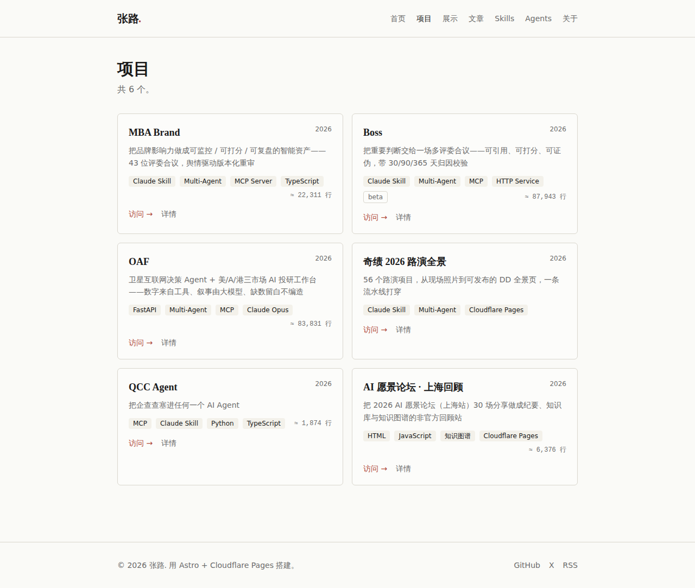

# zhanglu.net

张路的个人站。聚合：项目、展示、公众号文章、本机 Claude Skills、社交链接。

- **线上**: https://zhanglu.net
- **备用**: https://zhanglu-net.pages.dev
- **仓库**: https://github.com/zhanglunet/zhanglu.net

## 预览

[](https://zhanglu.net)

| 项目（每个标注源码行数） | Skills 列表 | 关于页 |
|---|---|---|
| [](https://zhanglu.net/projects/) | [](https://zhanglu.net/skills/) | [](https://zhanglu.net/about/) |

## 技术栈

Astro 5 · Tailwind 4 · MDX · Cloudflare Pages · Node 22 · pnpm 9

所有内容是 markdown / JSON 文件，无 CMS、无数据库。`git push` 即部署。

## 本地开发

```bash
pnpm install
pnpm dev          # http://localhost:4321
pnpm build        # 出 dist/
pnpm preview      # 看构建结果
```

## 内容更新（速查）

| 想做什么 | 改什么 |
|---|---|
| 加项目 | `src/content/projects/<slug>.md` 或 `pnpm run new:project -- ...` |
| 加文章入口 | `src/content/articles/<slug>.md` |
| 同步本机 skills | `pnpm run sync:skills` |
| 改首页 tagline / bio | `src/data/about.json` |
| 改社交链接 | `src/data/social.json` |
| 改首页排版 / 加新区块 | `src/pages/index.astro` |
| 重截截图 | `agent-browser open <url> && agent-browser screenshot --full docs/screenshots/<name>.png` |

**详细指南**: [AGENTS.md](./AGENTS.md)（必读，含 schema、踩过的坑、CF Pages 配置、排错表）

## 部署链路

```
git push origin main → Cloudflare Pages (project: zhanglu-net) → 1-2 min → zhanglu.net
```

`main` 分支自动部署，PR 自动出 preview URL。

## AI 协作

本仓库设计成可被多 agent（Claude Code / Codex / Hermes）维护：

- 所有内容是强类型 markdown + JSON，Zod schema 在 `src/content/config.ts` 校验
- `AGENTS.md` 是所有 agent 通用的权威指南
- `CLAUDE.md` 用 `@AGENTS.md` 导入，Claude Code 自动加载
- Codex / Hermes 等其它 agent 应在 system prompt / context 里挂上 `AGENTS.md`

改任何内容前先读 `AGENTS.md`。

## 给 AI agent 调用

zhanglu.net 是 agent-friendly 站点 —— 所有内容在 build 时落成静态 JSON，挂在 `/api/*.json`。任何 agent 用 HTTP GET 直接拿，**CORS 全开，无 token，无 SDK，无注册**。CF Pages 边缘 cache 友好。

### TL;DR — 一行命令速查

| 想做 | 命令 |
|---|---|
| agent 第一跳，自发现 | `curl https://zhanglu.net/llms.txt` |
| 列出所有 skill | `curl -s https://zhanglu.net/api/skills.json \| jq '.items[].name'` |
| 拿单个 skill 全文（含 body） | `curl -s https://zhanglu.net/api/skills/mba.json \| jq -r .body_md` |
| 只看 featured | `curl -s https://zhanglu.net/api/skills.json \| jq '.items[] \| select(.featured)'` |
| 搜关键词（含全文） | `curl -s https://zhanglu.net/api/search.json \| jq '.items[] \| select(.text \| test("品牌"; "i"))'` |
| 列项目 / 文章 / 简介 | `curl https://zhanglu.net/api/{projects,articles,about}.json` |

或者用零依赖 CLI（Node 18+，`npx` 直接跑）：

```bash
npx zhanglu-net endpoints                          # 看 manifest + counts
npx zhanglu-net list skills --featured             # 列 featured skill
npx zhanglu-net get skill mba --md                 # 拿 mba skill 全文 markdown
npx zhanglu-net search "品牌判断" --type skill     # 在 skill 里搜
npx zhanglu-net list projects --status live --json # 列 live 项目，出 JSON
```

CLI 是端点的薄包装，加 `--json` 出原始 JSON 给 agent pipe，默认人类可读带颜色（非 TTY 自动关）。

### 端点清单

所有端点 build 时静态生成，`Content-Type: application/json; charset=utf-8`，带 `Access-Control-Allow-Origin: *`。

| 端点 | 用途 | 关键字段 |
|---|---|---|
| [`/api/index.json`](https://zhanglu.net/api/index.json) | manifest（agent 进站第一跳） | `counts`, `endpoints`, `version` |
| [`/api/skills.json`](https://zhanglu.net/api/skills.json) | 全部 Claude Skill 索引 | `items[].name/description/source/featured/handwritten` |
| `/api/skills/{slug}.json` | 单 skill（含正文） | 上述 + `body_md` |
| [`/api/projects.json`](https://zhanglu.net/api/projects.json) | 项目列表 | `items[].slug/title/tagline/tech/year/status/loc` |
| `/api/projects/{slug}.json` | 单项目（含正文） | 上述 + `body_md` |
| [`/api/articles.json`](https://zhanglu.net/api/articles.json) | 写作索引（站内 + 外链） | `items[].title/source/url/date/summary/tags` |
| [`/api/about.json`](https://zhanglu.net/api/about.json) | 张路简介 | `name/tagline/bio/tags/permalink` |
| [`/api/social.json`](https://zhanglu.net/api/social.json) | 公开社交链接（邮箱脱敏） | `links[].label/url/handle/icon` |
| [`/api/search.json`](https://zhanglu.net/api/search.json) | 扁平语料给客户端搜 | `items[].type/slug/title/text/url` |
| [`/llms.txt`](https://zhanglu.net/llms.txt) | [llmstxt.org](https://llmstxt.org) 约定，agent 自发现 | 文本 |

### 四种集成模式

**Claude Code** —— 我维护了 `/zhanglu` skill。把它拉到本地：

```bash
mkdir -p ~/.claude/skills/zhanglu
curl -s https://zhanglu.net/api/skills/zhanglu.json | jq -r .body_md > ~/.claude/skills/zhanglu/SKILL.md
```

之后说「查张路的 skill」「zhanglu 上的 X」「张路在做什么项目」，Claude Code 自动调 `npx zhanglu-net`。

**Codex / OpenAI function calling** —— 把每个端点注册成一个 tool（一次 GET 调用），返回 JSON 直接喂回模型。manifest 给 LLM 看一眼就能 follow 下一跳。

**Hermes / OpenClaw / 任何支持 HTTP tool 的 agent 框架** —— 把 `/api/index.json` 塞进 system prompt，agent 自己找下一步。语料 < 100KB，全量塞 context 也行。

**浏览器端 / Node / Python / 任何语言** —— 普通 HTTP：

```js
// 浏览器或 Node 18+ —— CORS 全开，无 preflight
const { items } = await fetch('https://zhanglu.net/api/skills.json').then(r => r.json());
```

```python
import urllib.request, json
with urllib.request.urlopen('https://zhanglu.net/api/skills.json') as r:
    data = json.load(r)
```

```go
resp, _ := http.Get("https://zhanglu.net/api/skills.json")
defer resp.Body.Close()
```

### 设计原则（不会变的承诺）

- **端点是静态文件**。不依赖任何外部 fetch，CF Pages 重建即更新，永远可用。
- **schema 在 `src/content/config.ts`**。Zod 强类型，端点是 schema 的薄序列化。
- **不做服务端搜索**。语料 < 100 项，`/api/search.json` 一次拉完，客户端 substring 就够。
- **不做鉴权**。公开内容才放进 `src/content/`，邮箱等 PII 在端点出口脱敏兜底。
- **CLI 零运行时依赖**。Node 18+ 内置 `fetch` + `parseArgs` + 手拼 ANSI，启动快。

### 延伸

- 站上接入指南（带交互）：[zhanglu.net/agents](https://zhanglu.net/agents)
- 为什么这么做 / 1.5 小时上线全过程：[zhanglu.net/posts/agent-cli](https://zhanglu.net/posts/agent-cli)
- 维护者文档：[`AGENTS.md`](./AGENTS.md) §14、[`docs/agent-cli/design.md`](./docs/agent-cli/design.md)、[`docs/agent-cli/dev-log.md`](./docs/agent-cli/dev-log.md)
- CLI 用户文档：[`cli/README.md`](./cli/README.md)

## License

MIT
