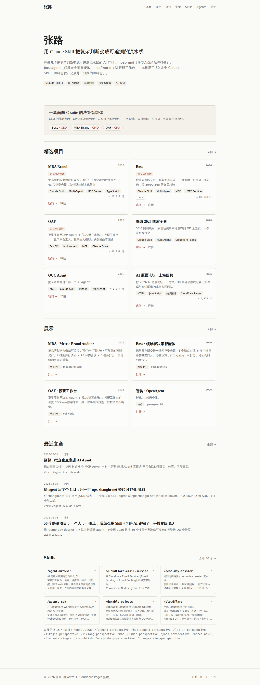
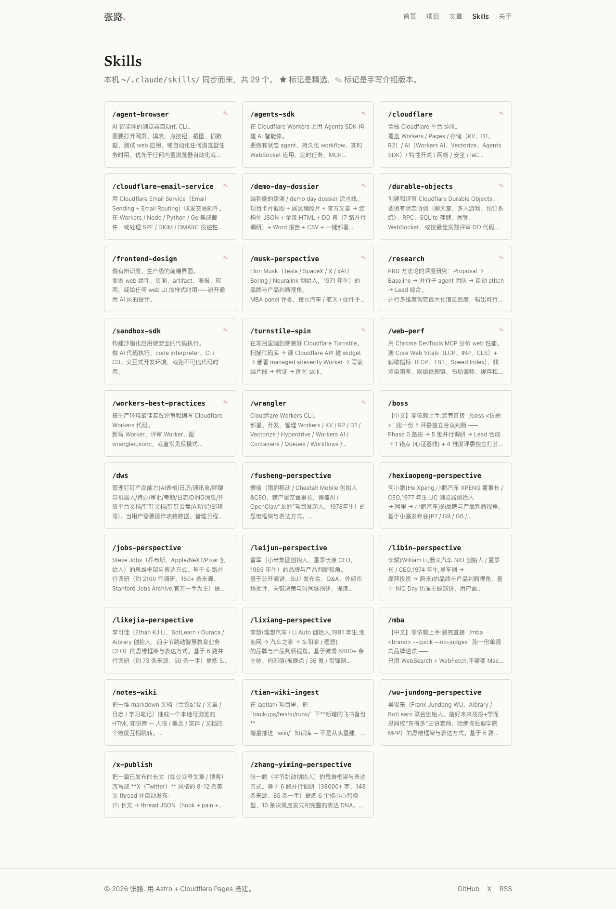
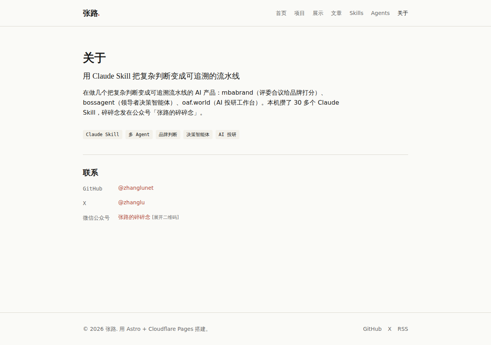

# zhanglu.net

张路的个人站。聚合：项目、公众号文章、本机 Claude Skills、社交链接。

- **线上**: https://zhanglu.net
- **备用**: https://zhanglu-net.pages.dev
- **仓库**: https://github.com/zhanglunet/zhanglu.net

## 预览

[](https://zhanglu.net)

| Skills 列表 | 关于页 |
|---|---|
| [](https://zhanglu.net/skills/) | [](https://zhanglu.net/about/) |

## 技术栈

Astro 5 · Tailwind 4 · MDX · Cloudflare Pages · Node 22 · pnpm 9

所有内容是 markdown / JSON 文件，无 CMS、无数据库。`git push` 即部署。

## 本地开发

```bash
pnpm install
pnpm dev          # http://localhost:4321
pnpm build        # 出 dist/
pnpm preview      # 看构建结果
```

## 内容更新（速查）

| 想做什么 | 改什么 |
|---|---|
| 加项目 | `src/content/projects/<slug>.md` 或 `pnpm run new:project -- ...` |
| 加文章入口 | `src/content/articles/<slug>.md` |
| 同步本机 skills | `pnpm run sync:skills` |
| 改首页 tagline / bio | `src/data/about.json` |
| 改社交链接 | `src/data/social.json` |
| 改首页排版 / 加新区块 | `src/pages/index.astro` |
| 重截截图 | `agent-browser open <url> && agent-browser screenshot --full docs/screenshots/<name>.png` |

**详细指南**: [AGENTS.md](./AGENTS.md)（必读，含 schema、踩过的坑、CF Pages 配置、排错表）

## 部署链路

```
git push origin main → Cloudflare Pages (project: zhanglu-net) → 1-2 min → zhanglu.net
```

`main` 分支自动部署，PR 自动出 preview URL。

## AI 协作

本仓库设计成可被多 agent（Claude Code / Codex / Hermes）维护：

- 所有内容是强类型 markdown + JSON，Zod schema 在 `src/content/config.ts` 校验
- `AGENTS.md` 是所有 agent 通用的权威指南
- `CLAUDE.md` 用 `@AGENTS.md` 导入，Claude Code 自动加载
- Codex / Hermes 等其它 agent 应在 system prompt / context 里挂上 `AGENTS.md`

改任何内容前先读 `AGENTS.md`。

## 给 AI agent 读

站点所有结构化内容在 build 时落成静态 JSON，挂在 `/api/*.json`。任何 agent 用 HTTP GET 直接拿，CORS 全开。

```bash
# 自发现入口
curl https://zhanglu.net/llms.txt
curl https://zhanglu.net/api/index.json

# 或用 CLI（零依赖）
npx zhanglu list skills --featured
npx zhanglu get skill mba --md
npx zhanglu search "品牌判断" --type skill
```

完整设计 / 端点 schema / CLI 文档见：

- [`docs/agent-cli/design.md`](./docs/agent-cli/design.md) — 设计文档
- [`docs/agent-cli/dev-log.md`](./docs/agent-cli/dev-log.md) — 开发记录
- [`cli/README.md`](./cli/README.md) — CLI 用户文档
- [`AGENTS.md`](./AGENTS.md) §14 — 维护指南

## License

MIT
